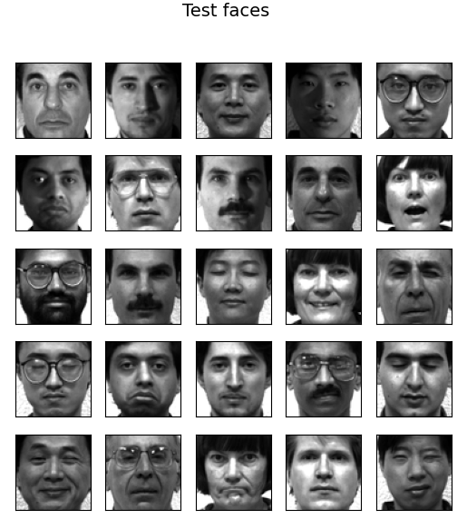
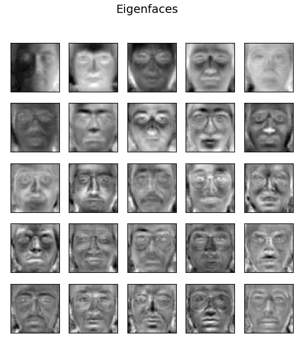
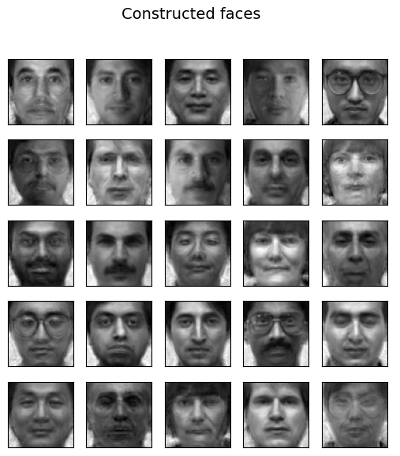
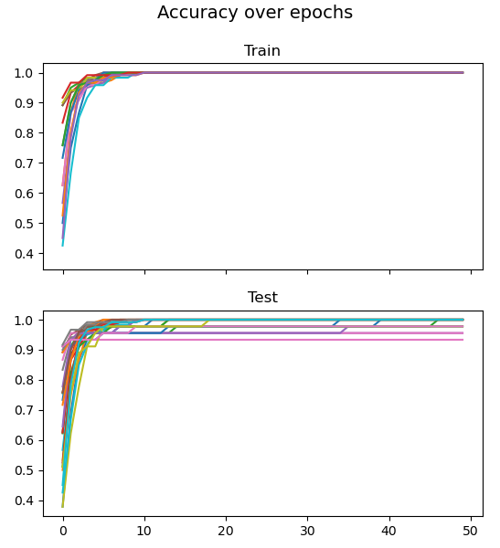

# pca-ann-facial-recognition
Facial recognition implemented in python employing principal component analysis and artifical neural networks (PCA-ANN).

### Quick summary of PCA-ANN
A neural network is created for each of the subjects being recognized (15 subjects, so 15 neural networks). The networks are trained on the eigenfaces of the faces, which represent how much the subject's face differs from the average face. Multiple eigenvectors can be created which means multiple different ways a subject can differ from the average.

Run `main.py` to use an interactive terminal program where you can create, train, test, evaluate, and investigate a PCA-ANN network with configurable parameters.

## Screenshots

Above are faces generated by combining the eigenfaces in various ways. Compare these to the original test faces.

